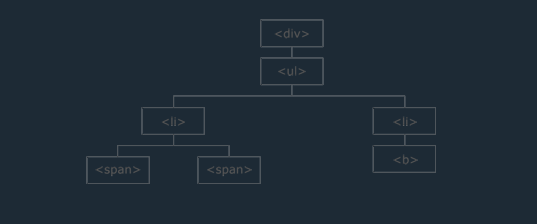

In this repository i will practice jQuery Basics, Events, Effects, HTML, Traversing, Ajax etc.

## Table of Contents

- [Introduction](#what-is-jquery)
- [Google CDN](#google-cdn)
- [Syntax](#basic-syntax)
- [Advance Selectors](#advance-selectors)
- [Mouse Events](#mouse-events)
- [Keyboard Events](#keyboard-events)
- [Form Events](#form-events)
- [Window Events](#window-events)
- [Get Method](#get-method)
- [Class Methods](#class-methods)
- [Jquery Traversing](#jquery-traversing)

## What is jQuery?

jQuery is a lightweight, "write less, do more", JavaScript library.

The purpose of jQuery is to make it much easier to use JavaScript on your website.

jQuery takes a lot of common tasks that require many lines of JavaScript code to accomplish, and wraps them into methods that you can call with a single line of code.

jQuery also simplifies a lot of the complicated things from JavaScript, like AJAX calls and DOM manipulation.

The jQuery library contains the following features:

<ul>
    <li>HTML/DOM manipulation</li>
    <li>CSS manipulation</li>
    <li>HTML event methods</li>
    <li>Effects and animations</li>
    <li>AJAX</li>
    <li>Utilities</li>
</ul>

### Google CDN

<code>https://cdnjs.cloudflare.com/ajax/libs/jquery/3.6.0/jquery.min.js</code>

### Basic Syntax

<pre>
<code>
    $(document).ready(function(){

        // jQuery methods go here...

    });
</code>
</pre>

### Advance Selectors

<table>
    <thead>
        <tr>
            <th>SL</th>
            <th>Selector</th>
            <th>Description</th>
        </tr>
    </thead>
    <tbody>
        <tr>
            <td>1</td>
            <td>$("*")</td>
            <td>"*" is a universal operator</td>
        </tr>
        <tr>
            <td>2</td>
            <td>$("ul li")</td>
            <td>Here ul is parent and li is child </td>
        </tr>
        <tr>
            <td>3</td>
            <td>$(".abc, .xyz")</td>
            <td>Multiple Classes</td>
        </tr>
        <tr>
            <td>4</td>
            <td>$("h1, div, p")</td>
            <td>Multiple Tags</td>
        </tr>
        <tr>
            <td>5</td>
            <td>$("p:first")</td>
            <td>Page first p element</td>
        </tr>
        <tr>
            <td>6</td>
            <td>$("p:last")</td>
            <td>Page last p element</td>
        </tr>
    </tbody>
</table>

### Mouse Events

<table>
    <thead>
        <tr>
            <th>SL</th>
            <th>Event Name</th>
            <th>Description</th>
        </tr>
    </thead>
    <tbody>
        <tr>
            <td>1</td>
            <td>click()</td>
            <td>When click target element this method work</td>
        </tr>
        <tr>
            <td>2</td>
            <td>dblclick()</td>
            <td>When double click element this method work </td>
        </tr>
        <tr>
            <td>3</td>
            <td>contextmenu()</td>
            <td>When right click mouse this method work</td>
        </tr>
        <tr>
            <td>4</td>
            <td>mouseenter()</td>
            <td>When You mouse enter target element then this event work</td>
        </tr>
        <tr>
            <td>5</td>
            <td>mouseleave()</td>
            <td>When You mouse leave target element then this event work</td>
        </tr>
    </tbody>
</table>

### Keyboard Events

<table>
    <thead>
        <tr>
            <th>SL</th>
            <th>Event Name</th>
            <th>Description</th>
        </tr>
    </thead>
    <tbody>
        <tr>
            <td>1</td>
            <td>keypress()</td>
            <td>When pressing any keyboard key this event works perfectly 😍</td>
        </tr>
        <tr>
            <td>2</td>
            <td>keyup()</td>
            <td>When pressing any keyboard key with clicked and down the finger, hold key this event fired! </td>
        </tr>
        <tr>
            <td>3</td>
            <td>keydown()</td>
            <td>When pressing any keyboard key and getting up your finger on the key then this event run!</td>
        </tr>
    </tbody>
</table>

### Form Events

<table>
    <thead>
        <tr>
            <th>SL</th>
            <th>Event Name</th>
            <th>Description</th>
        </tr>
    </thead>
    <tbody>
        <tr>
            <td>1</td>
            <td>focus()</td>
            <td>When clicked any form feild this event worked!</td>
        </tr>
        <tr>
            <td>2</td>
            <td>blur()</td>
            <td>When focus out target form feild this event worked!</td>
        </tr>
        <tr>
            <td>3</td>
            <td>change()</td>
            <td>When change any select option then change() event worked!</td>
        </tr>
        <tr>
            <td>4</td>
            <td>select()</td>
            <td>If select form feild any text or data then select() method worked!</td>
        </tr>
        <tr>
            <td>5</td>
            <td>submit()</td>
            <td>Submit() method worked when any form submited!</td>
        </tr>
    </tbody>
</table>

### Window Events

<table>
    <thead>
        <tr>
            <th>Sl</th>
            <th>Event Name</th>
            <th>Description</th>
        </tr>
    </thead>
    <tbody>
        <tr>
            <td>1</td>
            <td>scroll()</td>
            <td>When you scroll window screen then scroll() method worked!</td>
        </tr>
        <tr>
            <td>2</td>
            <td>resize()</td>
            <td>When you resize window screen then resize() method worked!</td>
        </tr>
        <tr>
            <td>3</td>
            <td>load()</td>
            <td>! load() method remove jq version > 3, Now it's replace document.ready()</td>
        </tr>
        <tr>
            <td>2</td>
            <td>unload()</td>
            <td>! unload() method remove jq version > 3</td>
        </tr>
    </tbody>
</table>

### Get method

<table>
    <thead>
        <tr>
            <th>SL</th>
            <th>Event Name</th>
            <th>Description</th>
        </tr>
    </thead>
    <tbody>
        <tr>
            <td>1</td>
            <td>text()</td>
            <td>When you get only element text then you can use text()</td>
        </tr>
        <tr>
            <td>2</td>
            <td>html()</td>
            <td>When you can get html() structure of target element then use html() method.</td>
        </tr>
        <tr>
            <td>3</td>
            <td>attr()</td>
            <td>attr() use when you can see target element classes, ids, tags etc.</td>
        </tr>
        <tr>
            <td>4</td>
            <td>val()</td>
            <td>When you need target element value then you can use val() method.</td>
        </tr>
    </tbody>
</table>

### Class Methods

<table>
    <thead>
        <tr>
            <th>SL</th>
            <th>Event Name</th>
            <th>Description</th>
        </tr>
    </thead>
    <tbody>
        <tr>
            <td>1</td>
            <td>addClass()</td>
            <td>When you any class in target element then use addClass()</td>
        </tr>
        <tr>
            <td>2</td>
            <td>removeClass()</td>
            <td>When you any remove class in target element then use removeClass()</td>
        </tr>
        <tr>
            <td>3</td>
            <td>toggleClass()</td>
            <td>toggleClass() are use when toggle target element class.</td>
        </tr>
    </tbody>
</table>

### Jquery-Traversing

jQuery traversing, which means "move through", are used to "find" (or select) HTML elements based on their relation to other elements. Start with one selection and move through that selection until you reach the elements you desire.

The image below illustrates an HTML page as a tree (DOM tree). With jQuery traversing, you can easily move up (ancestors), down (descendants) and sideways (siblings) in the tree, starting from the selected (current) element. This movement is called traversing - or moving through - the DOM tree.

### Traversing Up the DOM Tree

Three useful jQuery methods for traversing up the DOM tree are:
#### jQuery Traversing - Ancestors
<ul>
<li>parent()</li>
<li>parents()</li>
<li>parentsUntil()</li>
<li>closest()</li>
<li>parentsUntil()</li>
</ul>

#### jQuery Traversing - Descendants

<ul>
<li>children()</li>
<li>find()</li>
</ul>